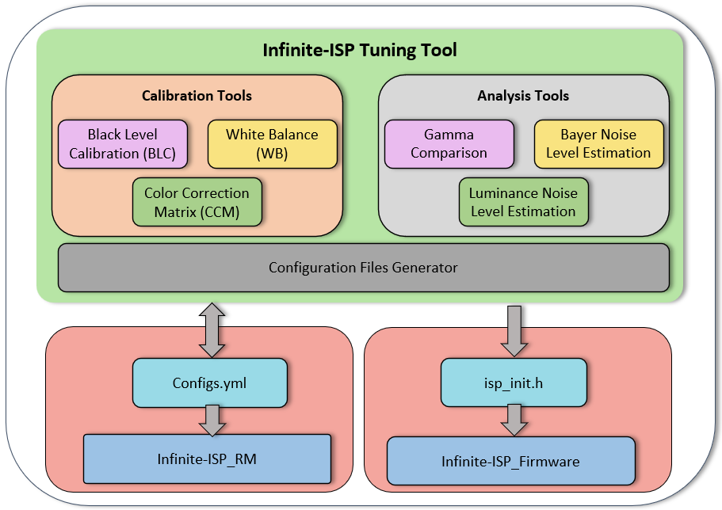
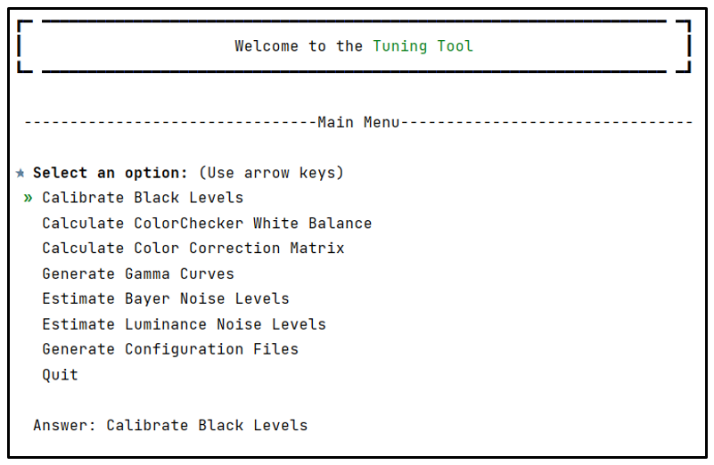

# Infinite-ISP
Infinite-ISP is a one stop solution for all your ISP development needs - from algorithms to an FPGA prototype and associated firmware, tools, etc. Its primary goal is to offer a unified platform that empowers ISP developers to accelerate ISP innovation. It includes a complete collection of camera pipeline modules written in Python, an FPGA bit-stream & the associated firmware for the implementation of the pipeline on the Kria KV260 development board and lastly a stand-alone Python based Tuning tool application for the pipeline.  The main components of the Infinite-ISP project are listed below:

| Repository name        | Description      | 
| -------------  | ------------- |
| **[Infinite-ISP_AlgorithmDesign](https://github.com/xx-isp/infinite-isp)**                        | Python based model of the Infinite-ISP pipeline for algorithm development |
| **[Infinite-ISP_ReferenceModel](https://github.com/10xEngineersTech/Infinite-ISP_ReferenceModel)**                         | Python based fixed-point model of the Infinite-ISP pipeline for hardware implementation |
| **[Infinite-ISP_FPGABitstream](https://github.com/10xEngineersTech/Infinite-ISP_FPGABitstream)**                                      | FPGA bit-stream for the  Kria kV260’s Xilinx® ZU5EV Ultrascale FPGA|
| **[Infinite-ISP_Firmware](https://github.com/10xEngineersTech/Infinite-ISP_Firmware)**                                      | Firmware for the Kria kV260’s embedded Arm® Cortex®A53 processor|
| **[Infinite-ISP_Tuning Tool](https://github.com/10xEngineersTech/Infinite-ISP_TuningTool)** :anchor:                             | Collection of calibration and analysis tools for the Infinite-ISP |

# Infinite-ISP Tuning Tool
## Overview

Infinite-ISP Tuning Tool is a console-based ISP (image signal processor) tuning application that is specifically designed to tune various modules in the [Infinite-ISP_ReferenceModel](https://github.com/10xEngineersTech/Infinite-ISP_ReferenceModel). Apart from working along with Infinite-ISP pipeline, this tuning tool can be used as a seperate stand-alone application to perform image quality analysis.

This cross-platform application provides a diverse range of algorithms aimed at calibrating a Bayer RAW image coming directly from an image sensor.





## Usage

Tuning Tool is designed to work with the Infinite-ISP_ReferenceModel. It uses the config file from the Infinite-ISP_ReferenceModel, performs the calibration, and updates the config file with the tuned parameters that can be used in the pipeline. For more details see [User Guide](https://github.com/10xEngineersTech/InfiniteISP_TuningTool#user-guide)

Infinite-ISP Tuning Tool can be used separately as a stand-alone application for image quality analysis. This comprehensive toolset not only provides user with precise control over the calibration modules, but also allows user to analyse the quality of the images using the analysis modules. With respect to its usage, it is divided into two categories:

- Calibration Tools

- Analysis Tools

- Generate Configuration Files

## Features
The Infinite-ISP Tuning Tool provides the following features.

| Module             | Description                                                               |
| ----------------- | ------------------------------------------------------------------ |
| Black Level Calibration (BLC) | Calculates the black levels of a raw image for each channel (R, Gr, Gb, and B). 
| ColorChecker White Balance | Calculates the white balance gains (R gain and B gains) on a ColorChecker RAW or RGB image.|
| Color Correction Matrix (CCM) | Calculates a 3x3 color correction matrix using a ColorChecker RAW or RGB image.|
| Gamma | Compares the user-defined gamma curve with the sRGB color space gamma ≈ 2.2.| 
| Bayer Noise Level Estimation | Estimates the noise levels of the six grayscale patches on a ColorChecker RAW image.|
| Luminance Noise Level Estimation | Estimates the luminance noise level of the six grayscale patches on a ColorChecker RAW or RGB image.|
| Generate Configuration Files | Generates the configuration files for the Infinite-ISP_ReferenceModel and FPGA.| 


## Getting Started

### Prerequisites
The project is compatible with `Python_3.10.11`. <br>
<br>The dependencies are listed in the [requirements.txt](https://github.com/10xEngineersTech/InfiniteISP_TuningTool/blob/master/requirements.txt) file. <br>
<br>The project assumes pip package manager as a pre-requisite. <br>
### Tool Setup 
To use the Tuning Tool, follow these steps:
-  Clone the repo using 
    ```shell
    git clone https://github.com/10xEngineersTech/InfiniteISP_TuningTool.git
    ```

-  Install all the requirements from the requirements file by running
    ```shell
    pip install -r requirements.txt
    ```


### How to  Run
After cloning the repository and installing all the dependencies, follow these steps:

- Open the terminal and navigate to the project directory.

- Run the [tuning_tool.py](https://github.com/10xEngineersTech/InfiniteISP_TuningTool/blob/qa_improvements_ss/tuning_tool.py) file using Python by executing the following command:
    ```shell
    python tuning_tool.py
    ```
    
By following the above steps, the tool will start, clear the console and display a welcome message.
### Example
Upon successfully launching the Tuning Tool, its main menu pops up with a list of all available modules.



- To run a specific module, simply select the corresponding option from the menu using the up and down arrow buttons. For instance, to start the Black Level Calibration (BLC) module, choose option 1.

- In each module, the first step is to display a main menu that outlines the specific functionalities and requirements of that module. The menu guides through the necessary steps and options to perform the calibration or analysis associated with the module.

- Each module has different requirements and sub-menus based on its unique functionality. Once the required inputs are provided, the algorithm specific to that module will be executed.

 - Upon completing of a module, options are presented to either restart that specific module, go back to the main menu to select another module, or exit the Tuning Tool. This allows for flexible exploration and fine-tuning of multiple modules conveniently.


## User Guide
For more comprehensive documentation and to understand how to use the Tuning Tool effectively, please visit the [User Guide](https://github.com/10xEngineersTech/Infinite-ISP_TuningTool/blob/f681de0f08ddd9966c045d018ebdae32587b6863/docs/Tuning%20Tool%20User%20Guide.pdf). 

## License
This project is licensed under Apache 2.0 (see [LICENSE](https://github.com/10xEngineersTech/InfiniteISP_TuningTool/blob/documentation_updates/LICENSE.txt) file).


## Contact
For any inquiries or feedback regarding this project, feel free to reach out to us.


Website: http://www.10xEngineers.ai

LinkedIn: https://www.linkedin.com/company/10x-engineers/
 
